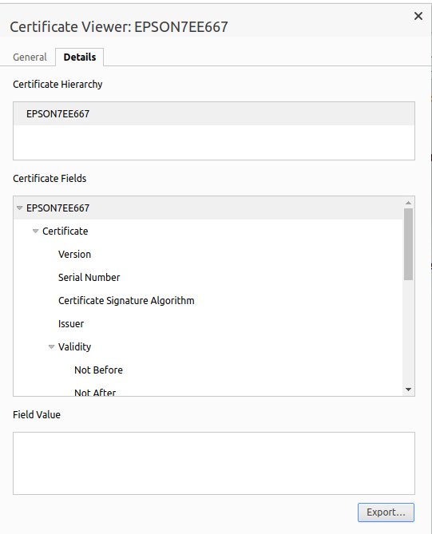

=================================
Printer ePos without IoT in HTTPS
=================================

With the restrictions of the various browsers (Chrome, Edge), 
it is essential to communicate with ePos printers using HTTPS.

.. note::
   *ePos Printer* is a printer that can work without IoT Box 
   (the POS sends the tickets to be printed directly to the printer).

   Applicable products:

   * TM-H6000IV-DT (Receipt printer only)
   * TM-T70II-DT
   * TM-T88V-DT
   * TM-L90-i
   * TM-T20II-i
   * TM-T70-i
   * TM-T82II-i
   * TM-T83II-i
   * TM-T88V-i
   * TM-U220-i
   * TM-m10
   * TM-m30
   * TM-P20 (Wi-Fi® model)
   * TM-P60II (Receipt: Wi-Fi® model)
   * TM-P60II (Peeler: Wi-Fi® model)
   * TM-P80 (Wi-Fi® model)

   More detailed list: `Epos printer 
   <https://c4b.epson-biz.com/modules/community/index.php?content_id=91>`_

Generate a Self-Signed certififcate
===================================

Go to ip address of your ePos printer: `http://printer-ip`

.. note::
   The IP address is automatically printed by the printer during startup

.. important::
   It is strongly recommended to assign a fixed IP address to the printer from the network router

go to :menuselection:`Authentication --> Certificate List`, then create a new Self-Signed Certificate

- **Common Name**: `IP address of the ePos Printer`
- **Validity Period**: `10`

Create and reboot the printer

After reboot go to :menuselection:`Security --> SSL/TLS`, then check if 'Selfsigned Certificate' is
 selected

Export this Self-Signed certififcate
====================================

When your printer is rebooted go to the ip address through https: `https://printer-ip`
You need to accept the self signed certificate.
So as not to have to accept it several times we will import it into Chrome

Click on :menuselection:`Not secure --> Certificate is not valid`.

.. image:: media/epos_https001.png
    :align: center

On tab **Details** click on **Export**

Import this Self-Signed certififcate to your browser (Chrome)
=============================================================

In Chrome go to :menuselection:`Settings --> Privacy and security --> Security --> Manage certificates`

.. note::
   You can directly copy past this link `chrome://settings/certificates`

On tab **Authorities** click on **Import** and select all functionnality of the certificate

Import this Self-Signed certififcate to your Android device
===========================================================

In Android go to `parameter` and search for `certificate` with the search tool
Click on `Certificate AC` (Install from a stockage device)
Accept the advertissement and select the certificate.
