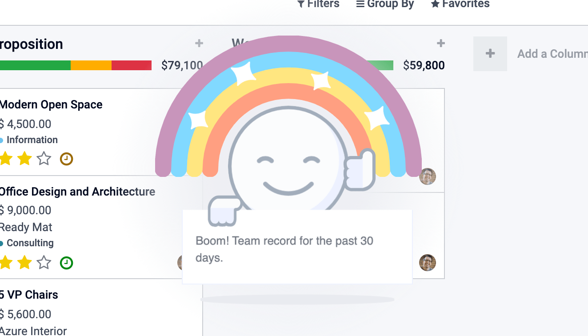

=======
Effects
=======

Effects are graphical elements that can be displayed on top of the page.

A good example would be the rainbow man:

Effect service
================

Overview
--------

* Technical name: `effect`
* Dependencies: None

The `effect` service provides a way to display graphical effects in odoo. 

Here's how this can be displayed:

.. code-block:: js

    const effectService = useService("effect");
    effectService.add({
      type: "rainbow_man",
      message: "Boom! Team record for the past 30 days.",
    });

API
---

.. js:function:: add(params)

  :param object params: the parameters for the effect. They will get passed along to the underlying effect.
  :param object params.type?: the name of the desired effect. Default to "rainbow_man".

  Display an effect.

Available effects
=================

Currently, the only effect is the rainbow_man.

Rainbow man
-----------

.. code-block:: js

  effectService.add({ type: "rainbow_man" });

Type 
****

`rainbow_man`

API
***

.. list-table::
    :widths: 20 20 20 40
    :header-rows: 1
    
    * - Name 
      - Type
      - Default
      - Description
    * - `params.message`
      - `Object?`
      - `"Well Done"`
      - The message in the notice the rainbowman holds or the content of the notification if effects are disabled. 
        
        Can be a simple a string. 
        
        Can be a string representation of html (prefer component if you want interactions in the DOM).
    * - `params.img_url`
      - `string?`
      - `"/web/static/img/smile.svg"`
      - The url of the image to display inside the rainbow.
    * - `params.messageIsHtml`
      - `boolean?`
      - `false`
      - Set to true if the message encodes html, s.t. it will be correctly inserted into the DOM.
    * - `params.fadeout`
      - `("slow"|"medium"|"fast"|"no")?`
      - `"medium"`
      - Delay for rainbowman to disappear.
      
        `"fast"` will make rainbowman dissapear quickly.

        `"medium"` and 'slow' will wait little longer before disappearing (can be used when `options.message` is longer). 

        `"no"` will keep rainbowman on screen until user clicks anywhere outside rainbowman.

    * - `params.Component`
      - `owl.Component?`
      - `RainbowMan`
      - Component class to instantiate (if effects aren't disabled).
    * - `params.props`
      - `object?`
      - `{}`
      - If params.Component is given, its props can be passed with this argument.

Add an effect
=============

Effect Registry
---------------

The effects are stored in a registry called `effects`.
You can add new effects by providing a name and a function.

.. code-block:: js

  const effectRegistry = registry.category("effects");
  effectRegistry.add("rainbow_man", rainbowManEffectFunction);

The function must follow this API:

.. js:function:: newEffectFunction(env, params)

    :param Env env: the environment received by the service
    
    :param object params: the params received from the add function on the service.

    :returns: `({Component, props} | void)` A component and its props or nothing.

This function must create a component and return it. This component is mounted inside the 
effect component container.

.. warning ::

  The effects can be disabled through the settings. You should check for this in your code and make 
  sure that you do not return a component in that case. Instead, you may want to use the notification service. 

Use case example: add a sepia effect. 
=====================================

Let's say we want to add an effect that add a sepia look at the page. 

.. code-block:: js

  /** @odoo-module **/

  import { registry } from "@web/core/registry";
  const { Component, tags } = owl;

  class SepiaEffect extends Component {}
  SepiaEffect.template = tags.xml`
      

  `;

  export function sepiaEffectProvider(env, params = {}) {
      return {
          Component: SepiaEffect,
      };
  }

  const effectRegistry = registry.category("effects");
  effectRegistry.add("sepia", sepiaEffectProvider);

And then, call it somewhere you want and you will see the result. 
Here, it is called in webclient.js to make it visible everywhere for the example.

.. code-block:: js

  const effectService = useService("effect");
  effectService.add({ type: "sepia" });

.. image:: images/odoo_sepia.png
    :alt: Odoo in sepia
    :width: 600
    :align: center

.. danger :: 
    The hook `useEffect` has absolutely nothing to do with the effects explained on this page.

    `useEffect` is simply a naming taken from the React framework.